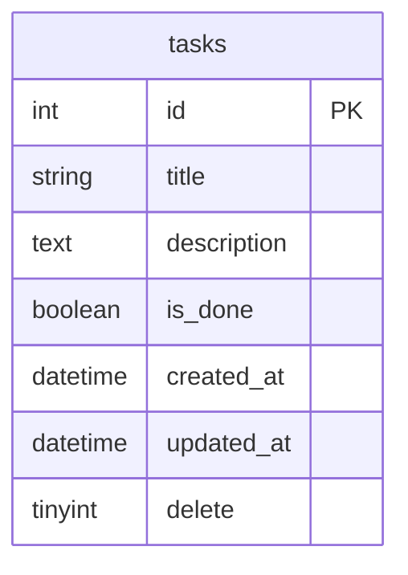

# 設計書

---

## 1. 画面設計

### 1-1. 概要
本アプリはタスク管理を目的としたCRUDアプリであり、以下の画面で構成される。

---

### 1-2. 画面一覧

| 画面ID | 画面名 | URL | 機能概要 | 主な要素 |
|:--|:--|:--|:--|:--|
| S01 | タスク一覧画面 | `/` | 登録されたタスクを一覧表示し、削除・完了状態変更を行う | タスクリスト、削除ボタン、完了チェック |
| S02 | タスク登録画面 | `/edit` | 新しいタスクを追加する | 入力フォーム（タイトル・説明）、登録ボタン |
| S03 | タスク編集画面 | `/edit/:id` | 既存のタスクを編集する、登録と更新は画面が一緒でIDを切り替えて更新 | 入力フォーム（既存データ付き）、更新ボタン |
| S04 | エラーページ（任意） | `/error` | 入力不正・通信エラー時に表示 | エラーメッセージ |

---

### 1-3. 画面構成

#### タスク一覧画面
```
+----------------------------------+
|      タスク管理アプリ              |
+----------------------------------+
| [＋ 新規タスク追加]                |
+----------------------------------+
| □ タスク1のタイトル   📝編集 🗑削除 |
|   説明テキスト                     |
+----------------------------------+
| ☑ タスク2のタイトル   📝編集 🗑削除  |
|   説明テキスト（完了済み）          |
+----------------------------------+
```

#### タスク登録/編集画面
```
+----------------------------------+
|      タスク登録/編集               |
+----------------------------------+
| タイトル:                          |
| [____________________________]   |
|                                  |
| 説明:                             |
| [____________________________]   |
| [____________________________]   |
| [____________________________]   |
|                                  |
| [登録/更新]  [キャンセル]          |
+----------------------------------+
```

#### エラーページ
```
+----------------------------------+
|          エラー                   |
+----------------------------------+
|      ⚠️ エラーが発生しました       |
|                                  |
|   エラーメッセージの内容            |
|                                  |
| [トップに戻る]                     |
+----------------------------------+
```

---

## 2. DB設計

### 2-1. 概要
本アプリではタスク情報を保持する `tasks` テーブルを中心に構成する。

---

### 2-2. テーブル定義（ER図イメージ）

| テーブル名 | カラム名 | 型 | NOT NULL | 主キー | 備考 |
|:--|:--|:--|:--:|:--:|:--|
| **tasks** | id | INT | ○ | ○ | 自動採番 |
|  | title | VARCHAR(100) | ○ |  | タスク名 |
|  | description | TEXT |  |  | 詳細説明 |
|  | is_done | BOOLEAN | ○ |  | 完了フラグ（true=完了） |
|  | created_at | DATETIME | ○ |  | 登録日時 |
|  | updated_at | DATETIME | ○ |  | 更新日時 |
|  | delete | TINYINT | ○ |  | 削除フラグ(デフォルト0) |

---

### 2-3. ER図（Mermaid表現）



---

## 3. API設計書

### 3-1. エンドポイント一覧

| No | 機能 | メソッド | エンドポイント | コントローラメソッド |
|----|------|-----------|----------------|-----------------------|
| 1 | タスク一覧取得 | GET | `/api/tasks` | `TaskController@index` |
| 2 | タスク登録 | POST | `/api/tasks` | `TaskController@store` |
| 3 | タスク詳細取得 | GET | `/api/tasks/{id}` | `TaskController@show` |
| 4 | タスク更新 | PUT / PATCH | `/api/tasks/{id}` | `TaskController@update` |
| 5 | タスク削除 | DELETE | `/api/tasks/{id}` | `TaskController@destroy` |
| 6 | 完了状態切替 | PATCH | `/api/tasks/{id}/toggle` | `TaskController@toggle` |

---

### 3-2. バリデーション
| 項目 | ルール | エラーメッセージ例 |
|------|-------|------------------|
| title | 必須 | タイトルを入力してください |

---

### 3-3. スタータスコード一覧
| ステータス  | 意味 |
|------|------------|
| 200 | 成功 |
| 201 | 作成成功 |
| 400 | バリデーションエラー |
| 404 | 対象が存在しない |
| 500 | サーバーエラー |
